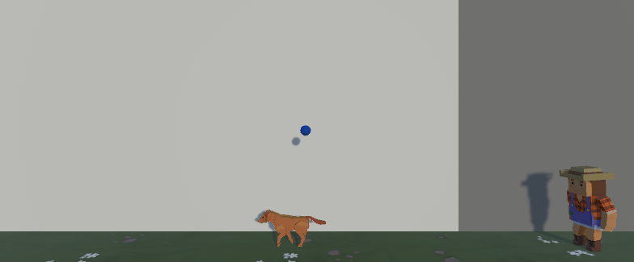
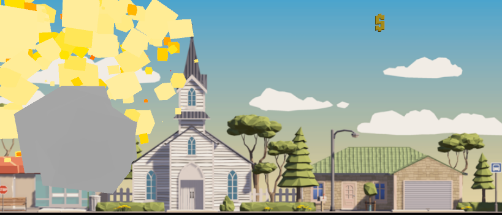
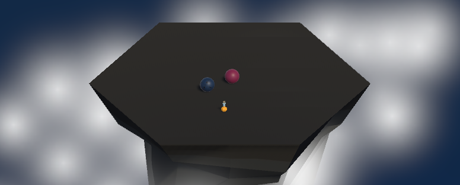
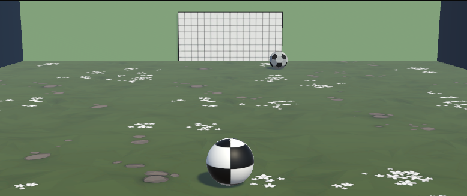
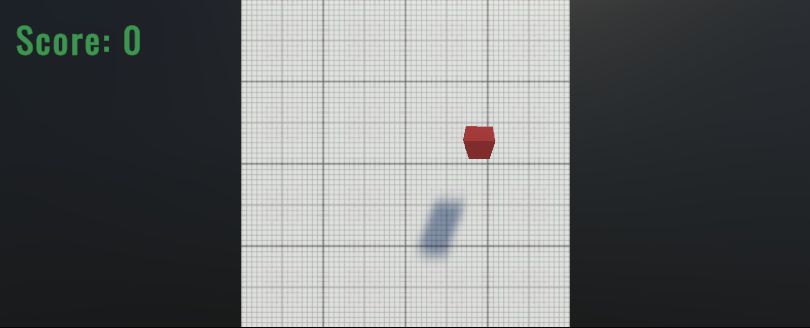
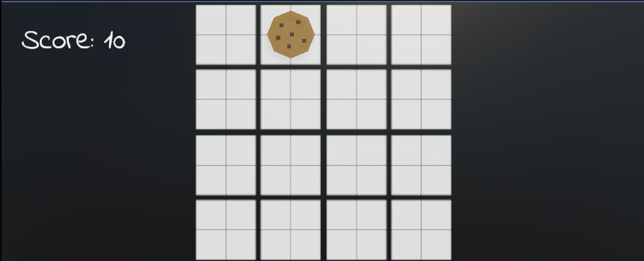

# Creación de Video Juego

    

  <h1 align="center">
    Prototipos de prueba 3D
     
     
  </h1>

## Contenido

- [Introducción](#introducción)
- [Código Fuente](#código-fuente)
- [Autores](#autores)
- [Copyright](#copyright)

## Introducción

- Prototipos de prueba 3D
- Objetivo: Aprender las primeras acciones para llevar a cabo un videojuego en 3D, tilizando la herramientas de Unity Hub.
- Video juegos de personajes realizando acciones simples como saltar, moverse en el escenario y colisionar objetos.
- Personajes:
- Cada prototipo tiene sus propias reglas
  * > Prototipo 1:
    > Avanzar con el carro en la pista esquivando los obstaculos que se presentan.
  * >Prototipo 2:
    > Alimentar a los animales con el alimento agregado (carne), moviendo el personaje de derecha a izquierda y lanzando comida.
  * >Prototipo 3:
    >El personaje salta para esquivar obstaculos en un escenario.
  * >Prototipo 4:
    >Consiste en que el personaje (pelota) debe permanecer en la pista pero esquivando a sus enemigos que intentaran sacarla.
  * >Prototipo 5:
    >El jugador debera desctruir los objetos que salen da la parte inferior girando, el debera tocar los objetos buenos y evitar los malos, podra descidir el nivel de dificultad.
    
## Código Fuente

### Lección 1
  * > El carro hacia adelante en la pista esquivando los obstaculos que se presentan, ya sean rocas, objetos de carretera, barriles, etc.

[Ver paquete de lección 1](./Prototipos/Prototipo1_laPerrona.unitypackage)

#### Resultado de la lección 1

### Lección 2
  * > El humano descide alimentar a sus animales con carne, lanzandola hacia ellos mientras los animales se dirigen hacia él, una vez que se los animales tocan la comida se destruye el objeto.

[Ver paquete de lección 2](./Prototipos/Prototipo2.unitypackage)

[Evidencias](./Prototipo2.pdf)

#### Resultado de la lección 2

### Desafio 2
  * > Consiste en un jugador, que al momento que bolas caen aleatoriamente del cielo y tiene que enviar a su perro a atraparlas antes de que caigan al suelo.

[Ver paquete de Desafio 2](./Desafios/Desafio2.unitypackage)
    
#### Resultado de la lección 2

#### Evidencia del desafio
[Evidencias](./Desafio2.pdf)

#### Lección 3 
  * > Consiste en un personaje con un fondo, en el cual el jugador lo controle. El personaje salta tocando la barra espaciadora mientras se encuentran obstaculos en la pista.

[Ver paquete de lección 3](./Prototipos/Prototipo3.unitypackage)
    
#### Resultado de la lección 3

### Desafio 3
  * > Consiste en un jugador representado por un globo que tiene que avanzar y mantenerse en curso sin ir mucho hacia arriba o hacia abajo, sin embargo no debe tocar el obscatulo de bombas porque explotaria y termina el juego, puede usar el simbolo de moneda para ganar algun punto.

[Ver paquete de Desafio 3](./Desafios/Desafio3.unitypackage)
    
#### Resultado de la lección 3

#### Evidencia del desafio
[Evidencias](./Desafio3.pdf)

#### Lección 4 
  * > Consiste en que el personaje (pelota) debe permanecer en la pista pero esquivando a sus enemigos que intentaran sacarla, los enemigos no desaparecen, sin embargo puede tomar alguna ayuda que le permitira tener una especie de poder para mantenerse más tiempo.

[Ver paquete de lección 4](./Prototipos/Prototipo4.unitypackage)
    
#### Resultado de la lección 4

### Desafio 4
  * > Consiste en controlar una pelota girando la cámara alrededor de ella y aplicando una fuerza hacia adelante, pero en lugar de tirarla por el borde, el objetivo es lanzarla hacia la red contraria mientras ellos intentan ingresar a tu red.

[Ver paquete de Desafio 4](./Desafios/Desafio4.unitypackage)
    
#### Resultado de la lección 4

#### Evidencia del desafio
[Evidencias](./Desafio4.pdf)

#### Lección 5 
  * > El jugador debera destruir los objetos que salen da la parte inferior girando, el debera tocar los objetos buenos y evitar los malos, los objetos salen de forma aleatoria y regresaran hacia abajo, podra descidir el nivel de dificultad para descurbrir sus habilidades.

[Ver paquete de lección 5](./Prototipos/Prototipo5.unitypackage)
    
#### Resultado de la lección 5

### Desafio 5
  * > Consiste en conseguir toda la comida que aparece en una cuadrícula mientras evitas las calaveras, ya que pueden perjuducar y terminar el juego.

[Ver paquete de Desafio 5](./Desafios/Desafio5.unitypackage)
    
#### Resultado de la lección 5

#### Evidencia del desafio
[Evidencias](./Desafio5.pdf)

## Autor
María Cárdenas

## Copyright
Derechos Reservados 2024
