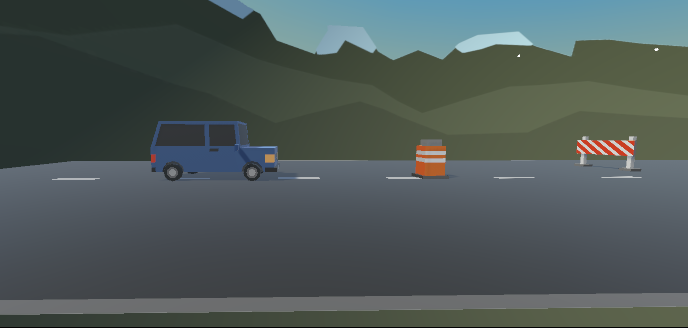
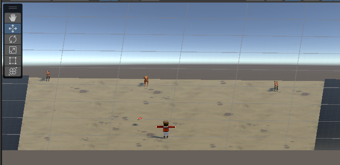
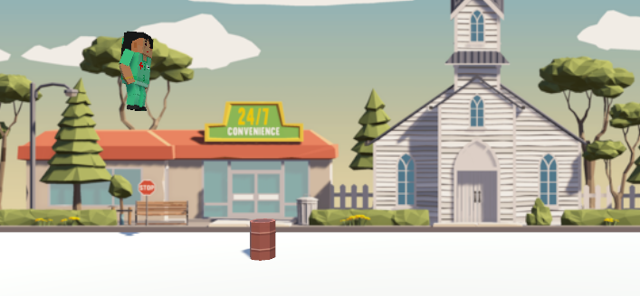

# Creación de Video Juego

    

  <h1 align="center">
    Prototipos de prueba 3D
     
     
  </h1>

## Contenido

- [Introducción](#introducción)
- [Código Fuente](#código-fuente)
- [Autores](#autores)
- [Copyright](#copyright)

## Introducción

- Prototipos de prueba 3D
- Objetivo: Aprender las primeras acciones para llevar a cabo un videojuego en 3D, tilizando la herramientas de Unity Hub.
- Video juegos de personajes realizando acciones simples como saltar, moverse en el escenario y colisionar objetos.
- Personajes:
- Cada prototipo tiene sus propias reglas
  * > Prototipo 1:
    > Avanzar con el carro en la pista esquivando los obstaculos que se presentan.
  * >Prototipo 2:
    > Alimentar a los animales con el alimento agregado (carne), moviendo el personaje de derecha a izquierda y lanzando comida. 

## Código Fuente

#### Lección 1
  * > El carro hacia adelante en la pista esquivando los obstaculos que se presentan, ya sean rocas, objetos de carretera, barriles, etc.

[Ver paquete de lección 1](./Prototipo1_laPerrona.unitypackage)

#### Resultado de la lección 1

#### Lección 2
  * > El humano descide alimentar a sus animales con carne, lanzandola hacia ellos mientras los animales se dirigen hacia él, una vez que se los animales tocan la comida se destruye el objeto.

[Ver paquete de lección 2](./Prototipo2.unitypackage)

[Evidencias](./Prototipo2.pdf)

#### Resultado de la lección 2

#### Lección 3 
  * > Consiste en un personaje con un fondo, en el cual el jugador lo controle. El personaje salta tocando la barra espaciadora mientras se encuentran obstaculos en la pista.

[Ver paquete de lección 3](./Prototipo3.unitypackage)
    
#### Resultado de la lección 2

## Autores
María Cárdenas

## Copyright
Derechos Reservados 2024
